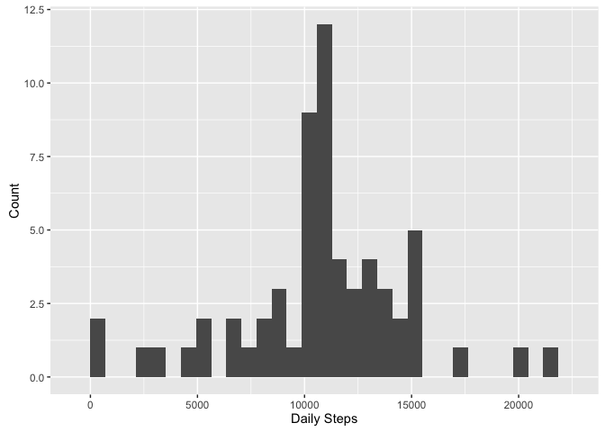

# Reproducible Research: Peer Assessment 1


```r
library(knitr)

library(rmarkdown)

library(ggplot2)
```

## Loading and preprocessing the data

setwd to my local folder, open and download activity data. Doing some simple search,
I can see that 2304/5856 step data points are "NA" and the default for the date column is chr


```r
setwd("~/Projects/JHU Coursera/RepData_PeerAssessment1")
activity_data <- read.csv(unz("activity.zip", "activity.csv"), header = TRUE, stringsAsFactors = FALSE)
activity_data$date <- as.Date(activity_data$date)
```

## What is mean total number of steps taken per day?

We take care of this by installing the ggplot package, creating a dataframe of summary
statistics, and identifying that summary data


```r
daily_steps <- aggregate(activity_data$steps, list(activity_data$date), sum)
colnames(daily_steps) <- c("date", "steps")

qplot(daily_steps$steps, geom = "histogram", xlab = "Daily Steps", ylab = "Count", bins = 15)
```

```
## Warning: Removed 8 rows containing non-finite values (stat_bin).
```

\

```r
summary(daily_steps)
```

```
##       date                steps      
##  Min.   :2012-10-01   Min.   :   41  
##  1st Qu.:2012-10-16   1st Qu.: 8841  
##  Median :2012-10-31   Median :10765  
##  Mean   :2012-10-31   Mean   :10766  
##  3rd Qu.:2012-11-15   3rd Qu.:13294  
##  Max.   :2012-11-30   Max.   :21194  
##                       NA's   :8
```

The mean and median total steps are 10765 and 10766, respectively.

## What is the average daily activity pattern?


```r
daily_averages <- aggregate(activity_data$steps, list(activity_data$interval), mean, na.rm = TRUE)
colnames(daily_averages) <- c("interval", "steps")        
qplot(daily_averages$interval, daily_averages$steps) + geom_line() + geom_point(alpha = 0.05)
```

\

```r
daily_averages[which.max(daily_averages$steps), 1]
```

```
## [1] 835
```

The 5 minute interval, 835, has the maximum averages across all days.

## Imputing missing values


```r
activity_data$steps <- ifelse(is.na(activity_data$steps), 
                            daily_averages$steps[match(activity_data$interval, daily_averages$interval)], activity_data$steps)

daily_steps_cleaned <- aggregate(activity_data$steps, list(activity_data$date), sum)
colnames(daily_steps_cleaned) <- c("date", "steps")
qplot(daily_steps_cleaned$steps, xlab = "Daily Steps", ylab = "Count", geom = "histogram")
```

```
## `stat_bin()` using `bins = 30`. Pick better value with `binwidth`.
```

\

Since the NA values were part of 8 days and those values were replaced with monthly 5 minute averages, 8 daily values at the median were included. This reduced the variance and created a tighter SD.

## Are there differences in activity patterns between weekdays and weekends?


```r
week_df <- data.frame(c("Monday", "Tuesday", "Wednesday", "Thursday", "Friday", "Saturday", "Sunday"), c("weekday", "weekday", "weekday", "weekday", "weekday", "weekend", "weekend"))
colnames(week_df) <- c("week", "class")
week_df$class <- as.factor(week_df$class)

activity_data$day <- weekdays(activity_data$date)
shortcut <- merge(activity_data, week_df, by.x = "day", by.y = "week")
colnames(shortcut)[5] <- "week_factor"
activity_data <- shortcut[ , 2:5]

week_factors <- aggregate(steps ~ interval + week_factor, data = activity_data, mean)
ggplot(week_factors, aes(x = interval, y=steps)) + geom_line() + facet_grid(week_factor ~ .)
```

\

There appears to be more activity during the mid-day portions of the weekends. :)
